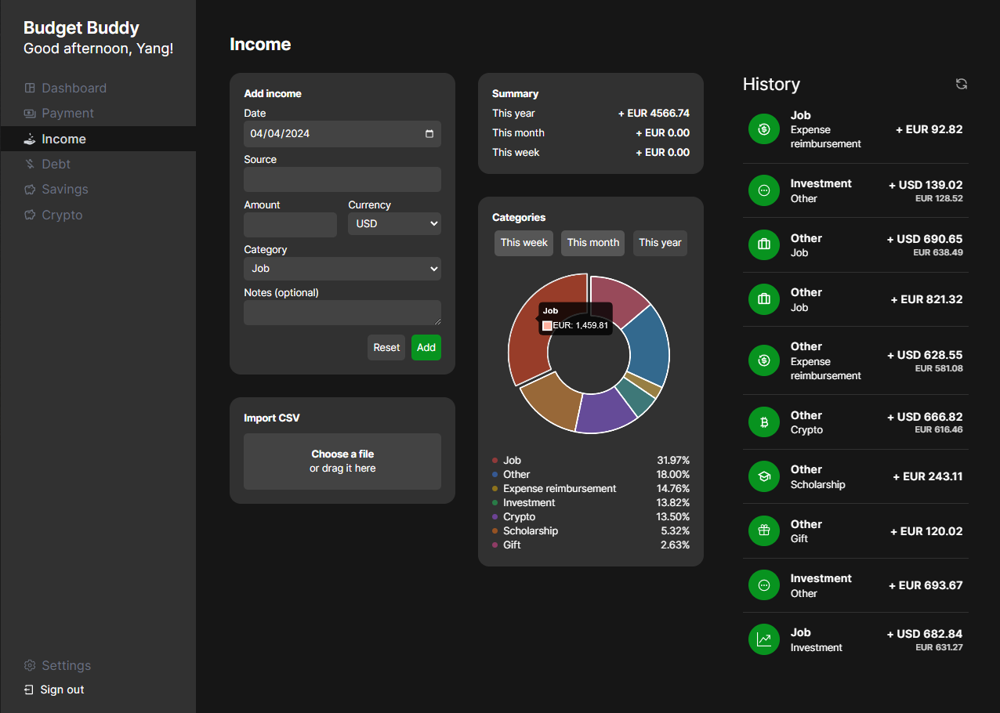

# YANGXDEV

## Budget Buddy

`nextjs-budget-buddy` is a project that helps individuals manage their personal finances and budget effectively. It is built using Next.js, a React-based framework that enables server-side rendering and generates static websites for React-based web applications. The project utilizes Tailwind CSS for efficient and customizable styling. Deployment of the project is facilitated by Vercel, a cloud platform for static sites and serverless functions.

---

### Contents

- [Overview](#overview)
- [Screenshots](#screenshots)
- [Technologies](#technologies)
- [Installation](#installation)
- [Structure](#structure)
- [Deployment](#deployment)
- [Contact](#contact)
- [License](#license)

---

### Overview

With `nextjs-budget-buddy`, users can track their expenses, incomes, investments, and soon, cryptocurrencies. It provides a comprehensive solution for managing personal finances. The project also integrates Next-auth, which enables users to log in using providers such as Google and GitHub, ensuring a secure and convenient authentication process.

The user-friendly interface and intuitive features of `nextjs-budget-buddy` make budgeting a seamless experience, empowering individuals to gain insights into their spending habits, set financial goals, and make informed financial decisions.

---

### Screenshots



<!-- <div class="flex">
    &nbsp;&nbsp;
</div> -->

---

### Technologies

- [Next.js](https://nextjs.org/), a React-based framework that enables functionality like server-side rendering and generating static websites for React-based web applications.
- [Tailwind CSS](https://tailwindcss.com/), a utility-first CSS framework that provides low-level utility classes to build designs directly in your markup. It's highly customizable and efficient.
- [Next-Auth](https://next-auth.js.org/), a library for handling authentication in Next.js applications. It provides a simple and flexible way to implement authentication features such as sign up, sign in, and session management.
- [Prisma ORM](https://www.prisma.io/), a powerful database toolkit that provides an easy-to-use interface for working with databases in your application. It offers features like database modeling, query building, and migrations, making it a popular choice for developers.
- [Vercel](https://vercel.com), a cloud platform for static sites and serverless functions. It allows for seamless deployment of web projects with features like automatic deployments from Git and serverless functions.

---

### Installation

To get this project up and running on your local machine, follow these steps:

1. **Clone the Repository:**
   ```
   git clone https://github.com/yangxdev/nextjs-budget-buddy.git
   ```
2. **Navigate to the Project Folder:**
   ```
   cd nextjs-budget-buddy
   ```
3. **Install Dependencies:**
   Use npm to install the required dependencies.
   ```
   npm install
   ```
   If you prefer using yarn:
   ```
   yarn install
   ```
4. **Start the Development Server:**
   Run the development server to view the project in your browser.
   ```
   npm run dev
   ```
   or with yarn:
   ```
   yarn dev
   ```
5. **Open in Your Browser:**
   Once the development server is running, open your browser and go to http://localhost:3000 to see the project in action.
   Now you have the project set up locally, and you can explore it, make modifications, and test it in your development environment.

---

### Structure

The project is organized into the following key directories, each serving a specific purpose:
- `app`
    - `api`: 
        - The api folder in the nextjs-budget-buddy project contains subfolders such as auth, currency, and database. These subfolders house files that connect with external services to provide various functions.
        - The auth folder handles authorization-related functionality, allowing users to log in and authenticate their identity.
        - The currency folder deals with currency calculations, including conversion rates and other currency-related operations.
        - The database folder is responsible for handling CRUD (Create, Read, Update, Delete) operations with the project's database, enabling data storage and retrieval.
    - `protected`:
         - The `protected` folder contains routes that can only be accessed if the user is logged in with an account.
            - Currently, the supported login methods are Google and GitHub.
         - These routes are restricted to authenticated users to ensure that only authorized individuals can access sensitive information or perform certain actions.
         - To access the routes in the `protected` folder, the user must first authenticate using their Google or GitHub account.
    - `components`:

- `components`:
    - This folder houses components related to the navigation menu on the left side of the application.
    - These components are responsible for rendering the menu items, handling user interactions, and providing seamless navigation throughout the application.
- `prisma`:
    - The "prisma" folder contains the Prisma schema file.
    - This file, named "prisma.schema", defines the database schema and models for the Next.js Budget Buddy application.
    - It is used by the Prisma ORM to generate the necessary database queries and operations.
- `public`:
    - This folder contains image assets and icons used throughout the project.
<!-- - `app`
  - `components`
    - `content`: Contains components related to content sections, such as project descriptions and educational background.
    - `functional`: Encompasses functional components that handle specific features or functionalities.
    - `ui`: Houses reusable UI components for consistent styling and design patterns
  - `css`. Holds the project's styles using the `styles.module.css` file.
- `public`
  - `cv`: Hosts the Curriculum Vitae (CV) in PDF format for easy access.
  - `logos`: Stores logos used throughout the project.
  - `personal`: Contains images related to personal projects, providing visual representations.
  - `university`: Includes images related to university projects, showcasing academic endeavors.

#### Additional Notes:

- **Modular Components**: The division of components into content, functional, and ui within the app directory promotes modularity, making it easier to manage and reuse code.

- **Styles**: Centralized styling is maintained in the app/css directory through the styles.module.css file, ensuring a consistent and organized approach to styling.

- **Resource Storage**: The public directory serves as a centralized location for static assets, including the CV, project logos, and images related to both personal and university projects. -->

---

### Deployment
The deployment of this project is currently not ready due to authorization issues. Therefore, it is recommended to try running the project locally by following the steps mentioned in the Installation section. This will allow you to explore and test the project in your development environment.

<!-- This project is currently deployed on Vercel for personal use. If you wish to deploy a similar project, follow these steps:

#### Prerequisites:

- **Vercel Account**: Ensure you have an account on [Vercel](https://vercel.com). If not, sign up for a free account.

#### Deployment Steps:

1. **Connect Repository:**
   - Log in to your Vercel account.
   - Navigate to the dashboard and click on "Import Project."
   - Select the repository where your project is hosted.
2. **Configure Settings:**
   - Choose the branch you want to deploy (e.g., main or master).
   - Set the build command to match your project setup (e.g., npm run build).
3. **Environment Variables:**
   - If your project requires environment variables, configure them in the Vercel dashboard under the project settings.
4. **Deploy:**
   - Click on the "Deploy" button to initiate the deployment process.

#### Accessing the Dashboard:

To access the dashboard:

1. [Log in to Vercel](https://vercel.com/login).
2. Navigate to the dashboard to view deployment details, logs, and project settings.

#### Updating the Deployment:

For any updates or changes to the project, simply push the changes to the connected branch. Vercel will automatically trigger a new deployment. -->

---

### Contact

Feel free to reach out if you have any questions, suggestions, or just want to connect! You can contact me via:

- Email: yangxdev@gmail.com
- LinkedIn: [Yang Xiang](https://www.linkedin.com/in/yangxng/)
- Telegram: [yang.xng](https://t.me/yangxng)
- GitHub: [yangxdev](https://github.com/yangxdev)
- Personal Website: [yangxdev.com](https://www.yangxdev.com)

I'm open to collaboration, feedback, and discussions about software engineering, frontend development, or anything related to my projects.

Looking forward to hearing from you!

 

---

### License

MIT License

Copyright (c) 2024 yangxdev

Permission is hereby granted, free of charge, to any person obtaining a copy
of this software and associated documentation files (the "Software"), to deal
in the Software without restriction, including without limitation the rights
to use, copy, modify, merge, publish, distribute, sublicense, and/or sell
copies of the Software, and to permit persons to whom the Software is
furnished to do so, subject to the following conditions:

The above copyright notice and this permission notice shall be included in all
copies or substantial portions of the Software.

THE SOFTWARE IS PROVIDED "AS IS", WITHOUT WARRANTY OF ANY KIND, EXPRESS OR
IMPLIED, INCLUDING BUT NOT LIMITED TO THE WARRANTIES OF MERCHANTABILITY,
FITNESS FOR A PARTICULAR PURPOSE AND NONINFRINGEMENT. IN NO EVENT SHALL THE
AUTHORS OR COPYRIGHT HOLDERS BE LIABLE FOR ANY CLAIM, DAMAGES OR OTHER
LIABILITY, WHETHER IN AN ACTION OF CONTRACT, TORT OR OTHERWISE, ARISING FROM,
OUT OF OR IN CONNECTION WITH THE SOFTWARE OR THE USE OR OTHER DEALINGS IN THE
SOFTWARE.
